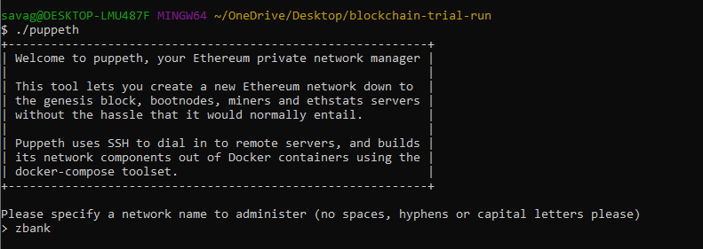
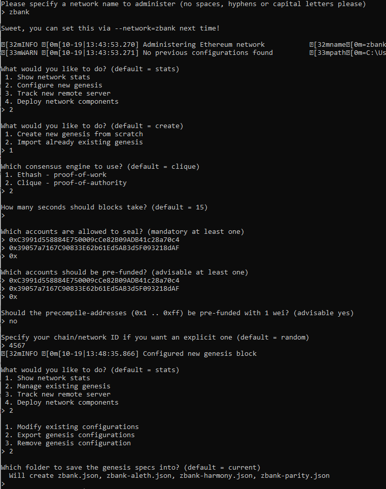
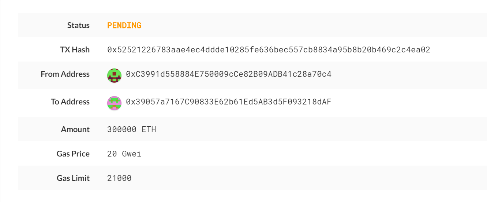

# Building-a-Blockchain
In this project I will set up a testnet blockchain

## Blockchain Instructions

### Environment Setup Instructions:
Install GETH
Install mycrypto app


### Building the Testnet Blockchain

First setup two nodes for the network using geth. Code is shown below:
```
./geth --datadir node1 account new
./geth --datadir node2 account new
```
By generating the two nodes for the network, we will be given account addresses that will be used later as our sealer addresses.

Next generate your genesis block by following the steps shown below:





As shown in the screenshot above, we first run puppeth and then specified a network name. 
To make things easier for development we will choose the Proof of Authority consensus algorithm

Next I pasted the seal addresses (retrieved from setup) under the accounts to seal and then once again under the accounts to be pre-funded. We prefund both accounts as their is no block rewards under Proof of Authority.

To keep the genesis cleaner we will choose no for pre-funding the pre-compiled accounts with wei.


Export genesis configurations. This will fail to create two of the files, but you only need networkname.json.

With the genesis block creation completed, we will now initialize the nodes with the genesis' json file.

Using geth, initialize each node with the new networkname.json.
./geth --datadir node1 init networkname.json
./geth --datadir node2 init networkname.json
Now the nodes can be used to begin mining blocks.

Run the nodes in separate terminal windows with the commands:
./geth --datadir node1 --unlock "SEALER_ONE_ADDRESS" --mine --rpc --allow-insecure-unlock
./geth --datadir node2 --unlock "SEALER_TWO_ADDRESS" --mine --port 30304 --bootnodes "enode://SEALER_ONE_ENODE_ADDRESS@127.0.0.1:30303" --ipcdisable --allow-insecure-unlock

NOTE: Type your password and hit enter - even if you can't see it visually!
Your private PoA blockchain should now be running!

See below the transaction recorded between the two nodes:




